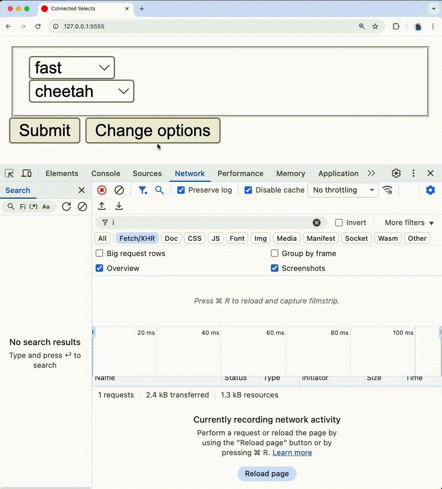

# README

This repo showcases an option to build connected selects using Turbo and Stimulus.
[This commit](https://github.com/pinzonjulian/connected_selects/commit/fc91138b4ca30f74519dd455a8cddf0944d77db1)
contains the solution.



## Behaviour

```html
<form>
    <select>Parent</select>
    <turbo-frame>
        <select>Dependent</select>
    </turbo-frame>
</form>
```
> Basic HTML structure of the solution

This solution has a form containing two select tags: speed (Parent) and animals (dependent) contained within a form.
When the `speed` select is changed (Parent), the form submits automatically via a `GET` request to a specific endpoint that returns options,
the `animals` (Dependent) select is disabled while the request finishes and is populated with content coming from the server when the request is done.

## Design
There are 4 main components in this design:
1. A Stimulus Controller to provide interactivity
1. Form submitters to submit the form to a specialised endpoint
1. A Turbo Frame wrapping the animals select to update it.
1. Loading state using CSS

### A Stimulus Controller to provide interactivity
The `form_controller.js` is used to control the form.
```html
<form action="/" data-controller="form">
    ...
</form>
```

The `<select>` tag reacts to changes and submits the form via the `data-action` attribute.

> Stimulus uses the `change` event by default for `<select>` tags.

```html
<select name="speed" 
        id="speed" 
        data-action="form#submit" 
        data-form-submitter-param="submit-as-get">
</select>
```

This would read as:
> on `change` (implicit), execute the `submit` function in the `form` controller with the `submitter` param 

The Stimulus controller checks if a submitter is present and requests the form to be submitted with that submitter:
```js
submit({ params }) {
  if (params.submitter) {
    this.element.requestSubmit(document.getElementById(params.submitter));
  } else {
    this.element.requestSubmit();
  }
}
```

### Form submitters to submit the form to a specialised endpoint

The form has 2 submitters: A regular submit button and another one that leverages `formaction` and `formmethod` ([docs](https://developer.mozilla.org/en-US/docs/Web/HTML/Reference/Elements/button))
to change how and where the form is submitted.

```html
<button id="submit-as-get" 
        formaction="/options" 
        formmethod="get" 
        data-turbo-frame="options_select">Change options</button>
```

The Stimulus controller would then submit the form:
- to `/options`
- with the `GET` method
- pointing to the `options_select` Turbo Frame

> [!CAUTION]
> All the state from the form will be submitted, so sensitive information could end up in logs and be visible in non-secure connections. Consider filtering sensitive information.
> This is available in Rails via [Parameter Filtering](https://guides.rubyonrails.org/action_controller_advanced_topics.html#parameters-filtering)


### A Turbo Frame wrapping the animals select to update it selectively

When the request is submitted, Turbo identifies it as a Turbo Frame request which scopes changes to the DOM only
to the Frame referenced. 

In this example, the _animals_ `<select>` tag is wrapped with a `<turbo-frame>` element so that any Turbo DOM changes performed
by Turbo, only affect that frame.

```html+erb
<turbo-frame id="options_select">
  <div class="loading">
    <select name="loading" id="loading" disabled>
      <option value="loading">Loading...</option>
    </select>
  </div>
  <div class="content">
    <select name="animal" id="animal" data-action="turbo:frame">
      <% options.each do |animal| %>
        <option value="<%= animal %>"><%= animal %></option>
      <% end %>
    </select>
  </div>
</turbo-frame>
```
### Loading state using CSS
[Turbo adds attributes](https://turbo.hotwired.dev/reference/attributes#automatically-added-attributes) to the DOM when requests are in flight
so CSS can be used to display a loading state while the response comes back from the server. The `aria-busy="true"` attribute
is added to the `<turbo-frame>` while the request is in progress and is removed when the response is returned.

The markup then requires two wrapping elements to be present. In this example: 
- a wrapper (identified with the `.loading` class) wrapping a loading state select.
- a wrapper (identified with the `.content` class) for the real select where dynamic content will be slotted in. 

By targeing elements using CSS, the real select element is hidden and a loading state is presented:
```css
turbo-frame {
      & .loading { display: none;}
      & .content { display: block;}
      &[aria-busy="true"]{
        & .loading { display: block; }
        & .content { display: none; }
      }
  }
```

> [!NOTE]  
> This example is quite generic, so more careful selectors need to be used in a real scenario.


## Race conditions

The Rails controller handling the dynamic options delays the request based on the parameter sent from the `speed` (Parent) select
to simulate race conditions.
```ruby
  def options
    @options = animals[params[:speed].to_sym] || animals[:slow]
    case params[:speed].to_sym
    when :slow then sleep 10
    when :medium then sleep 6
    when :fast then sleep 1
    end
  end
```

Turbo includes mechanisms to deal with race conditions by default. When multiple requests are performed to drive a
single Frame, [Turbo will cancel past requests and keep only the latest one](https://github.com/hotwired/turbo/blob/0eff16396cdfcf621a9d6a88827e0cab88336211/src/core/frames/frame_controller.js#L327).


If you look closely, the "fast" request does not seems that fast when issuing mulitple requests in rapid succession. This 
is because I have a single server running and it has to wait until the calls to `sleep` finish for al requests. In a robust production
setup you'd have a load balancer and multiple servers available to process requests so you wouldn't see this issue if the query to 
retrieve the options took long.
